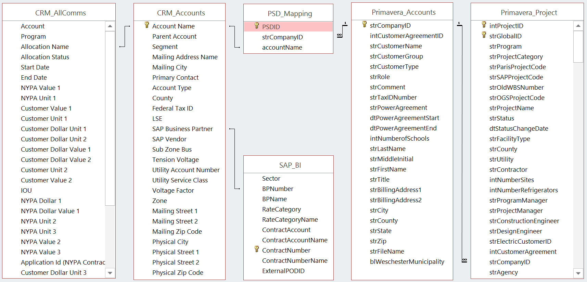
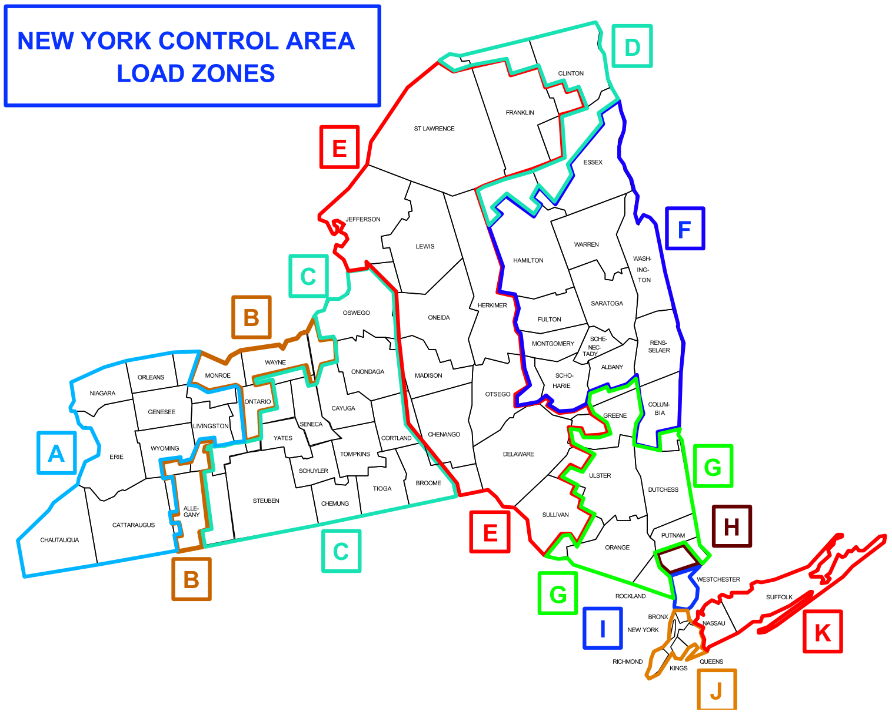

```{r setup, include=FALSE}
library(knitr)
opts_chunk$set(message=FALSE, warning=FALSE, comment=NA, fig.align = 'center')
```

# Background
The purpose of this exercise is to build a recommender system in Apache Spark to identify energy services products that customers of the New York Power Authority will likely be interested in.  These services include a wide array of products, ranging from lightweight facility audits to large-scale capital equipment upgrades and replacements.

## Motivation
This system can be used to aid the business development, marketing, and energy service implementation teams in their pursuit of customer projects. Due to limited staff bandwidth, optimizing resources in marketing projects most likely to be implemented by customers will represent a significant savings to the company.

The audience of the system is the New York Power Authority (NYPA) and its customers. NYPA has the legislative authority to provide energy services to a wide range of customer types. These customer groups, which may influence customer preference, include:

  * State & federal agencies, authorities, and organizations 
  * Local governments including cities, towns, villages, and counties
  * Rural municipalities and cooperatives operating their own utilities
  * Businesses and not-for profits receiving electric supply from the Authority


# Data Utilized
The data used to create the system is drawn from information housed by the company related to energy supply and previous energy services work. This data includes detailed information about project timelines, costs, and types, and is housed across three primary systems:
  * Oracle Primavera
  * Microsoft Customer Relationship Management
  * SAP Business Intelligence

## Data Preparation
These systems house varying data -- energy service projects, contact information, and energy consumption -- about NYPA's various customer groups.  Due to separate development of the functions supporting various aspects of NYPA's business, these systems were developed through separate efforts; as such, there is a lack of common unique identifiers across systems.  In order to attempt to uncover useful insights across the systems, snapshots of the systems are loaded into a common local database.  A table is created with a single unique identifier is created in the database to attempt a linking of the different data sources.  For the purposes of enabling broader company access to the data, the database is created in Microsoft Access:

```{r sql-table, echo=FALSE}

```

## Data Retrieval
Since the topic of interest is engagement in energy services, a query is executed to retrieve, for every project stored in Primavera, the customer zip code from CRM along with the Company ID, Project Category, and Customer Type from Primavera:

```{}
SELECT PSD_Mapping.PSDID,
CRM_Accounts.[Account Name], Primavera_Accounts.strCompanyID, Primavera_Project.intProjectID, 
CRM_Accounts.[Physical Zip Code], Primavera_Project.strProjectCategory, Primavera_Accounts.strCustomerType
FROM (Primavera_Accounts 
      INNER JOIN (CRM_Accounts 
                  INNER JOIN PSD_Mapping 
                  ON CRM_Accounts.[Account Name] = PSD_Mapping.accountName) 
      ON Primavera_Accounts.strCompanyID = PSD_Mapping.strCompanyID) 
INNER JOIN Primavera_Project 
ON Primavera_Accounts.strCompanyID = Primavera_Project.strCompanyID;
```


## Data Cleansing
The results from the query shown above are exported and stored as a csv file.  The `Physical_Zip_Code` has some values that contain the "plus 4" digits after the zip code; these are removed for consisteny.  One zip code contained in the file (11057) is not a valid US zip code; as such, projects containing this zip code are removed.  Finally, projects at NYPA's own facilities are removed.

```{r cleansing}
raw_projects <- read.csv('./AllProjects.csv', stringsAsFactors = FALSE)

library(stringr)
raw_projects$strProjectCategory <- as.factor(raw_projects$strProjectCategory)
raw_projects$Physical_Zip_Code <- str_sub(raw_projects$Physical_Zip_Code, 1, 5)
raw_projects <- subset(raw_projects, strCustomerType != "NYPA" & Physical_Zip_Code != "" & Physical_Zip_Code != "11057")
```

### Data Anonymization {-}
The sensitive nature of the customer data used in this system is rather sensitive; as such, it must be anonymized for the data to be publically shareable.  A function is created to anonymize the Company ID field from Primavera, as it is the only identifying characteristic in the query results.  The raw csv loaded is not made publicly available for this reason.  Though not used for this report, a function is also created to de-anonymize the data to allow for utilization within NYPA.

```{r anonymize-function}
set.seed(getOption("letter_seed"))
name_sub <- sample(LETTERS, 26)

anonymize <- function(old_vector) {
  new_vector <- character(0)
  for (i in 1:length(old_vector)) {
    new_nm <- NULL
    for (j in 1:str_length(old_vector[i])) {
      old_ltr <- substr(old_vector[i], j, j)
      new_ltr <- name_sub[which(LETTERS == old_ltr)]
      new_nm <- paste0(new_nm, new_ltr)
    }
    new_vector <- c(new_vector, new_nm)
  }
  new_vector
}
```

The anonymize function is applied to the query results, making sure to remove padding spaces.  The columns of the data frame are then reordered.

```{r anonymize-data}
raw_projects$strCompanyID <- anonymize(str_trim(raw_projects$strCompanyID))

library(dplyr)
raw_projects <- raw_projects %>%
  select(strCompanyID, Physical_Zip_Code, strProjectCategory, strCustomerType)
```


## Data Storage
As the system will be implemented in Apache Spark, the anonymized dataframe is saved to a JSON file, which will be used for further analysis and is available on [GitHub](https://www.github.com/dsmilo/DATA643/Projects/all_projects.json).

```{r json-export}
library(jsonlite)
projects_json <- toJSON(raw_projects)
write(projects_json, "all_projects.json")
```


# Creating the System
The system is implemented using a local installation of Apache Spark.  Creation of a development environment on Amazon Web Services was unsuccessful; due to the size of the dataset of interest, local memory is sufficient.

```{r setup-sparkr}
Sys.setenv(SPARK_HOME = "C:/Apache/Spark-1.6.2")
.libPaths(c(file.path(Sys.getenv("SPARK_HOME"), "R", "lib"), .libPaths()))
library(SparkR)
sc <- sparkR.init(master = "local")
sqlContext <- sparkRSQL.init(sc)
```

## Data Preparation
Before the system can be implemented, the data must be loaded and converted to the proper form (a user-item matrix).

### Loading the Data {-}
The data, as stored in a JSON file in the previous step, are loaded as a SparkR DataFrame:

```{r load-data}
spark_projects <- read.df(sqlContext, path = "./all_projects.json", source = "json")
spark_projects
```
It can be seen that the anonymized query results have been successfully imported as a SparkR DataFrame with 4 columns, each containing strings.

## User-Item Matrix
The data stored in `spark_projects` represent records of projects implemented -- that is, each row represents a project completed for a customer, including details about the customer and the project.  For this system, customers are considered users, and the project categories are considered items.  In order to create the user-item matrix, a pairwise matching of customers and project categories must be created:

```{r create-ratingtable}
ratingtable <- crosstab(spark_projects, "strCompanyID", "strProjectCategory")
```

The crosstab result is stored as a local R data frame.  To allow for easier processing of the ratings in a recommender system, it is converted to a matrix and the column of customer names is removed.  It is unknown if ratings of zero correspond to customers having been presented opportunities to complete projects in a given category --- a rating of 0 would represent a customer having been presented the opportunity and not implementing a project --- so all of these values are converted to `NA`.

```{r clean-ratingtable}
rownames(ratingtable) <- ratingtable[, 1]
ratingtable <- ratingtable %>% dplyr::select(-strCompanyID_strProjectCategory)
ratingtable <- as.matrix(ratingtable)
ratingtable[which(ratingtable == 0)] <- NA
```

### Definition of Rating {-}
In the created user-item matrix, the ratings in the cells of the matrix represent the number of projects in each category that each customer has implemented.  A customer implementing a project category multiple times is a sign of stronger affinity for a category than a single implementation; thus the data are not binarized. Additionally, a customer implementing more projects across multiple categories is an indication of a greater customer willingness to use NYPA's energy services -- for this reason the ratings are not mean-centered.


## Determining Similarity
The ratings matrix contains 166 users and 21 items, as vizualized below:
```{r plot-ratingtable, echo=FALSE}
library(reshape)
library(ggplot2)

user_item_viz <- melt(ratingtable)
names(user_item_viz) <- c("user", "item", "rating")
user_item_viz <- user_item_viz %>% dplyr::arrange(user, item)

ggplot(user_item_viz, aes(user, item, fill = rating)) + geom_raster() + scale_x_discrete("Users", breaks = NULL, labels = NULL) + scale_y_discrete("Items", breaks = NULL, labels = NULL)  + scale_fill_continuous(na.value = "white", low = "blue", high = "red", guide = "colourbar") + ggtitle("Transposed User-Item Matrix\n") + theme(legend.position = 'bottom', plot.title = element_text(lineheight=.8, face="bold"))
```

It can clearly be seen that the ratings matrix is rather sparse, although one item (the *Energy Efficiency* category) is very densely populated.  Viewing the relative sparsity of users against that of some items, and considering the dimensions of the matrix, a user-based collaborative filtering system is utilized to provide recommendations.

Due to issues encountered with the `recommenderlab` R package, a similarity function created for a [previous exercise](https://www.rpubs.com/dsmilo/DATA643-Project1) is used:

```{r sim-function}
vec_similarity <- function(v1, v2) {
  dot_product <- sum(v1 * v2, na.rm = TRUE)
  norm1 <- sqrt(sum(v1^2, na.rm = TRUE))
  norm2 <- sqrt(sum(v2^2, na.rm = TRUE))
  dot_product / (norm1 * norm2)
}
```

### User Similarity
The `vec_similarity` function is used to create a user similarity matrix, which contains 166 rows and 166 columns.

```{r sim-user}
sim_user <- matrix(NA, nrow = nrow(ratingtable), ncol = nrow(ratingtable))
for (i in 1:nrow(sim_user)) {
  for(j in 1:ncol(sim_user)) {
    sim_user[i, j] <- vec_similarity(ratingtable[i, ], ratingtable[j, ])
  }
}
rownames(sim_user) <- row.names(ratingtable) -> colnames(sim_user)
```

This similarity matrix could be used to provide recommendations based on a collaborative filtering system.  As this system is meant to support business development efforts, it is necessary to acknowledge that context may play a role in customer decisions to implement projects prior to making recommendations.

### Location Similarity
The location of a customer may have a significant effect on their energy-service-purchasing behavior.  Many local governments within New York State have implemented energy plans mandating energy services work that reduces total energy consumption, and electric utilities throughout the state have introduced incentives that reduce contribution to the system demand.  Also, energy demand, prices, and seasonality greatly by location within New York State:

```{r nyiso-map, echo=FALSE}

```

Given the potential importance of customer location, it is necessary to modify the similarity matrix based upon the distance between customers; zip code is used to calculate this distance.

#### Getting Zip Code Coordinates {-}
In order to get the coordinates for each zip code, the GeoNames [postalCodeSearch](http://www.geonames.org/export/web-services.html#postalCodeSearch) API is utilized.  This API returns information a given postal code, including name, country, and geographical coordinates.

To access the API, a wrapper is created to retrieve the information in JSON format.  The `postalCodes` element of the response contains a dataframe with the relevant responses -- this is stored in the `zip_info` data frame.

```{r geonames-wrapper}
get.zip_info <- function(zip_code) {
  username <- getOption('geonamesUsername')
  api_query <- paste0('http://api.geonames.org/postalCodeSearchJSON?country=US&username=', username,
                      '&postalcode=', zip_code)
  zip_info <- fromJSON(api_query)$postalCodes
  zip_info
}
```

With the function established, it is necessary to obtain a list of the unique zip codes included in the dataset.  This is done by registering the SparkR DataFrame as a table, executing a query against it, and converting the results to a vector for simplicity of processing.  The latitude and longitude of each zip code is extracted using the GeoNames API, and a local data frame is created to house the coordinates.

```{r get-coords}
registerTempTable(spark_projects, "all_projects")
zip <- sql(sqlContext, "SELECT DISTINCT Physical_Zip_Code FROM all_projects")
zip <- as.vector(collect(zip))

lat <- NULL; lng <- NULL

for (i in 1:length(zip)) {
  zip_data <- get.zip_info(zip[i])
  lat <- c(lat, zip_data$lat)
  lng <- c(lng, zip_data$lng)
}

zip_coords <- data.frame(zip, lat, lng, stringsAsFactors = FALSE)
```

#### Calculating Distances {-}
With the coordinates retrieved, it is possible to calulate the distance between customers in miles.  Given the distances being addressed since all locations are within New York State, an approximation can be made that a difference in $\theta$ degrees corresponds to $\frac{\theta}{360}$ percent of the Earth's circumference.  A function is created to calculate this distance given two pairs of coordinates, calculating equitorial and meridional distances separately:

```{r dist-function}
dist_mile <- function(lat1, lng1, lat2, lng2) {
  circ_eq <- 24902.461
  circ_md <- 24859.730
  circ <- (circ_eq + circ_md) / 2
  diff_lat <- (lat2 - lat1) / 360 * circ_md
  diff_lng <- (lng2 - lng1) /360 * circ_eq
  diff_dist <- sqrt(diff_lat^2 + diff_lng^2)
  diff_dist
}
```

A matrix is created containing the distances between each zip code in the dataset of interest:
```{r zip-dist}
zip_dist <- matrix(NA, nrow = nrow(zip_coords), ncol = nrow(zip_coords), dimnames = list(zip_coords$zip, zip_coords$zip))

for (i in 1:nrow(zip_dist)) {
  for (j in 1:i) {
    zip_dist[i, j] <- dist_mile(zip_coords[which(zip_coords$zip == rownames(zip_dist)[i]), 2],
                                zip_coords[which(zip_coords$zip == rownames(zip_dist)[i]), 3],
                                zip_coords[which(zip_coords$zip == colnames(zip_dist)[j]), 2],
                                zip_coords[which(zip_coords$zip == colnames(zip_dist)[j]), 3])
    zip_dist[j, i] <- zip_dist[i, j]
  }
}
```

In order to create a matrix that is useful for the generation of recommendations, a matrix containing distances must be calculated.  This is accomplished by populating a 166 by 166 matrix by keying off of the zip code for each user-user pair.

```{r dist-matrix}
sim_dist <- matrix(nrow = nrow(ratingtable), ncol = nrow(ratingtable), dimnames = dimnames(sim_user))

company_zips <- sql(sqlContext, "SELECT strCompanyID, Physical_Zip_Code from all_projects")
company_zips <- collect(company_zips)

for (i in 1:nrow(sim_dist)) {
  for (j in 1:i) {
    sim_dist[i, j] <- zip_dist[which(rownames(zip_dist) == 
                                       company_zips[min(which(company_zips$strCompanyID 
                                                              == rownames(sim_dist)[i])),2]), 
                               which(colnames(zip_dist) == 
                                       company_zips[min(which(company_zips$strCompanyID
                                                              == rownames(sim_dist)[j])),2])]
    sim_dist[j, i] <- sim_dist[i, j]
  }
}
```

The distances must be converted into similarities.  First the distances are rescaled to fall between 0 and 1, inclusive.  Next, the distances are converted assuming a simple $s = (1 - d$ relationship

```{r sim-dist}
sim_dist <- (sim_dist - min(sim_dist))/(max(sim_dist) - min(sim_dist))
sim_dist <- 1 - sim_dist
```


### Total Similarity
With the user-based and location-based similarity matrices created, they can be combined to form an overall similarity matrix for the production of recommendations:  $$S_{tot} = S_{user} \cdot S_{loc}$$

```{r sim-total}
sim_tot <- sim_user * sim_dist
```

The distribution of the total similarity matrix is plotted, along with the user and location similarity matrices:

```{r sim-plot, echo = FALSE, fig.width=8, fig.height=4}
sims <- data.frame(x = c(as.vector(sim_user), as.vector(sim_dist), as.vector(sim_tot)), sim = c(rep("User", length(as.vector(sim_user))), rep("Location", length(as.vector(sim_dist))), rep("Total", length(as.vector(sim_tot)))), row.names = NULL, stringsAsFactors = FALSE)

sims$sim <- factor(sims$sim, levels = c("User", "Location", "Total"))

library(scales)
ggplot(sims, aes(x = x, y = 3 * (..count..)/sum(..count..), fill = sim, col = sim)) + geom_histogram(alpha = 0.75, binwidth = 0.05, show.legend = FALSE) + scale_y_continuous('', labels=percent) + facet_wrap(~sim, nrow = 1, scales = "free_y") + scale_fill_hue(h.start = -120) + scale_color_hue(h.start = -120) + scale_x_continuous('Similarity') + ggtitle("Distribution of Similarity Matrix Values\n") + theme(legend.position = 'none', plot.title = element_text(lineheight=.8, face="bold"))
```

The total similarity function contains a large spike at 0 -- it can be seen that this is due to the large number of entirely dissimilar users (without the consideration of distance).  There are relatively few near-zero similarity values, with the remaining values roughly evenly distributed between 0.20 and 1.00.  A visualization of the total similarity matrix is provided below:

```{r sim-image, echo=FALSE, fig.height=6}
filled.contour(z = sim_tot, color.palette = cm.colors)
```

## Retrieving Recommendations
Using the overall similarity matrix, items can be recommended in the following way:

  * Identify the $n$ most-similar customers
  
  * Create a average of these users' ratings for an item, weighted by their similarity to the user of interest
  
Because there are only 21 items of interest, an estimated rating is gathered for each item.  As predicted ratings are provided for items that users have already engaged with, the actual ratings are also stored; this allows for accuracy measure calculation.  Due to the small number of items considered, the 75 most-similar users are used to predict ratings, that is $n = 75$.

```{r get-recs}
ratings <- data.frame(User = character(0), Item = character(0), Predicted = double(0), Actual = double(0), stringsAsFactors = FALSE)
n <- 75

for(i in 1:nrow(sim_tot)) {
  nearest <- sim_tot[, i][-i]
  nearest <- sort(nearest, decreasing = TRUE)[1:n]
  for(j in 1:ncol(ratingtable)) {
    neighbor_ratings <- ratingtable[which(rownames(ratingtable) %in% names(nearest)), j]
    pred_rating <- sum(nearest * neighbor_ratings, na.rm = TRUE) /
      sum(nearest[which(!is.na(neighbor_ratings))])
    tmp_rat <- data.frame(User = rownames(ratingtable)[i], Item = colnames(ratingtable)[j],
                          Predicted = pred_rating, Actual = ratingtable[i, j], stringsAsFactors = FALSE)
    ratings <- rbind(ratings, tmp_rat)
  }
}

ratings <- ratings %>% dplyr::group_by(User) %>% dplyr::arrange(desc(Predicted), desc(Actual))
```

# Results
Investigation of the results shows poor predictive value, with a general over-estimation of user ratings.  Investigation of the dataset shows that there are three ratings that are as much as roughly 20 times the next-highest rating.  To correct for any bias introduced by these values, a second iteration of the predicted recommendations is executed with the three values removed from the user-item matrix.

```{r get-ratings, echo=FALSE}
ratingtable2 <- ratingtable
ratingtable2[which(ratingtable2 %in% sort(as.vector(ratingtable), decreasing = TRUE)[1:3])] <- NA

ratings <- data.frame(User = character(0), Item = character(0), Predicted = double(0), Actual = double(0), stringsAsFactors = FALSE)
n <- 75

for(i in 1:nrow(sim_tot)) {
  nearest <- sim_tot[, i][-i]
  nearest <- sort(nearest, decreasing = TRUE)[1:n]
  for(j in 1:ncol(ratingtable2)) {
    neighbor_ratings <- ratingtable2[which(rownames(ratingtable2) %in% names(nearest)), j]
    pred_rating <- sum(nearest * neighbor_ratings, na.rm = TRUE) / sum(nearest[which(!is.na(neighbor_ratings))])
    tmp_rat <- data.frame(User = rownames(ratingtable2)[i], Item = colnames(ratingtable2)[j], Predicted = pred_rating, Actual = ratingtable2[i, j], stringsAsFactors = FALSE)
    ratings <- rbind(ratings, tmp_rat)
  }
}

ratings <- ratings %>% dplyr::group_by(User) %>% dplyr::arrange(desc(Predicted), desc(Actual))
```

## Visualized Results
The plot of the user-item matrix from above is recreated with the three extreme values removed:
```{r plot-ratingtable2, echo=FALSE}
library(reshape)
library(ggplot2)

user_item_viz <- melt(ratingtable2)
names(user_item_viz) <- c("user", "item", "rating")
user_item_viz <- user_item_viz %>% dplyr::arrange(user, item)

ggplot(user_item_viz, aes(user, item, fill = rating)) + geom_raster() + scale_x_discrete("Users", breaks = NULL, labels = NULL) + scale_y_discrete("Items", breaks = NULL, labels = NULL)  + scale_fill_continuous(na.value = "white", low = "blue", high = "red", guide = "colourbar") + ggtitle("Transposed User-Item Matrix\n") + theme(legend.position = 'bottom', plot.title = element_text(lineheight=.8, face="bold"))
```

This is compared with the predicted ratings for users:
```{r plot-predictions, echo=FALSE}
library(reshape)
library(ggplot2)

ratings_viz <- ungroup(ratings)
ratings_viz <- ratings_viz %>% dplyr::arrange(User, Item)

ggplot(ratings_viz, aes(User, Item, fill = Predicted)) + geom_raster() + scale_x_discrete("Users", breaks = NULL, labels = NULL) + scale_y_discrete("Items", breaks = NULL, labels = NULL)  + scale_fill_continuous(na.value = "white", low = "blue", high = "red", guide = "colourbar") + ggtitle("Predicted Ratings\n") + theme(legend.position = 'bottom', plot.title = element_text(lineheight=.8, face="bold"))
```

It can be seen from the second plot that items with only a small number of user ratings are strongly skewed in the direction of those ratings, particularly the 8th row up, which has only one high rating.


## Tabulated Results
Predicted ratings are presented below for the revised model are presented below.  As seen in the second plot above, there are a number of `NA` ratings due to insufficent ratings for certain user-item pairs; these are excluded for clarity.

```{r results-table, echo=FALSE}
library(DT)
ratings_table <- subset(ratings, !is.na(Predicted), 1:3)
datatable(ratings_table, rownames = FALSE) %>% formatRound(3, 2)
```


## Performance
The root mean square error (RMSE) is calculated for the predictions against given ratings can be calculated:

$$RMSE = \sqrt{\frac{1}{n} \ \sum_{i=1}^{n} (y_i - \hat{y}_i)^2}$$

```{r RMSE}
have_actuals <- subset(ratings, !is.na(Actual))
RMSE <- sqrt(sum((have_actuals$Predicted - have_actuals$Actual)^2, na.rm = TRUE) / nrow(have_actuals))
```

This RMSE of `r round(RMSE, 3)` is a bit high, but may be satisfactory given the range of ratings.  It represents a significant improvement over the initial model with the extremely high values included, which returned a RMSE of 57.748.


# Conclusions
This recommendation system provides adequate recommendations for customers of the New York Power Authority for energy services products.  Implementation of a version of this system can be used to aid in the allocation of resources of NYPA's business and project development teams.  The inclusion of the context of location in the evalution of the system can allow for proper resource allocation across regions of the state.  Given the sparse nature of adoption of some project categories, this system may not be well-suited to predict all categories, as predicted ratings for these categories are skewed by the high ratings present in the one to two adopters.

## Future Improvements
In order to gain more accurate representations of predicted customer project adoption, improvements are envisioned in four different paths.  These improvements will allow for a more useful and more easily-adoptable system.


### Consideration of Additional Context {-}
While location was considered here, date project implementation can be included to incorporate further weighting to the development of a similarity matrix.


### Clarification of Existing Data {-}
As mentioned above, it is unclear whether zero ratings represent customers not presented with an opportunity to implement a project or customers electing not to proceed with a project.  Clarifying this and properly tracking these ratings as either 0 or `NA` will improve model accuracy.

For this exercise, the customer ID in Primavera was linked to its zip code in CRM.  Linking projects instead to site-specific zip codes may offer an added level of granularity.


### Incoproating Additional Data {-}
While the data in the system has been mapped, data stored in SAP BI was not utilized in this effort.  This mapping can be used to extract site- and time-specific energy consumption and demand data, which can further inform customer behavior.

CRM tracks all customer communications, including the text of email communications.  The text in these communications can be mined to extract customer sentiment, as well as key words that may allow for a content-based recommendation.
    

### Creation of a Logistic Regression System {-}
With the inclusion of additional data, as outlined above, the computational power required to implement a system may become taxing if a similarity matrix is to be created for each additional data dimension considered.  By binarizing the ratings (customer implemented vs. did not implement a project), a logistic regression model can be developed to predict the probability of a customer adopting a future project.  This would allow for the consideration of many quantiative and qualitative variables into an easy-to-understand predicted rating.

Such a regression system could be used in combination with a user-based collaborative filtering model to account not only for customer-specific bases for decision, but the effect of similar customers' behaviors.  This is especially relevant as many of NYPA's customers belong to public or industry associations and may be strongly influenced by the behavior of similar customers.


# References {-}
The Apache Software Foundation (2013).
*SparkR: R frontend for Spark. R package version 1.6.1.*

The Apache Software Foundation (2016).
'SparkR (R on Spark).'
*Apache Spark Documentation.*
https://spark.apache.org/docs/1.6.2/sparkr.html

Emaasit, Daniel (2015).
'Installing and Starting SparkR Locally on Windows OS and RStudio.'
*Emaasit's Blog.*
http://blog.danielemaasit.com/2015/07/26/installing-and-starting-sparkr-locally-on-windows-8-1-and-rstudio/

Wick, Marc (2016).
*GeoNames.*
http://www.geonames.org/

Wickham, Hadley (2009).
*ggplot2: Elegant Graphics for Data Analysis.*
Springer-Verlag New York.

Wickham, Hadley (2007).
'Reshaping data with the reshape package.'
*Journal of Statistical Software, 21(12).*
http://www.jstatsoft.org/v21/i12/paper

Wickham, Hadley and Francois, Romain (2015).
*dplyr: A Grammar of Data Manipulation. R package version 0.4.3.*
https://CRAN.R-project.org/package=dplyr

Xie, Yihui (2015).
*DT: A Wrapper of the JavaScript Library 'DataTables'. R package version 0.1.*
https://CRAN.R-project.org/package=DT

Wikipedia Contributors (2016).
'Earth.'
*Wikipedia, The Free Encyclopedia.*
https://en.wikipedia.org/w/index.php?title=Earth&oldid=729824635

```{r end-spark, echo=FALSE}
sparkR.stop()
```

